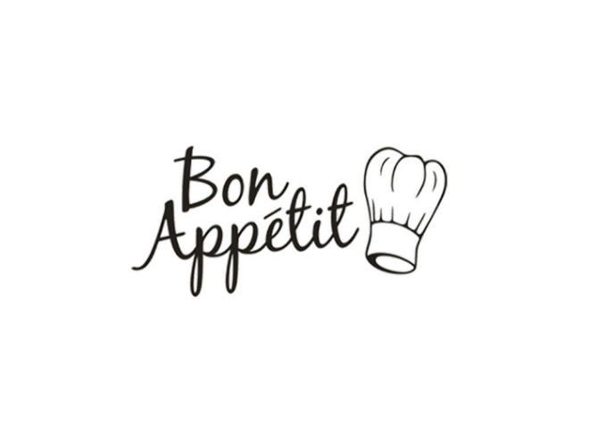

# Github Repos

:strawberry: Recipe app

  <kbd>
    </img>
  </kbd>

&nbsp;

## Technologies Used

✔️ REACT\
✔️ SASS\
✔️ AXIOS\
✔️ REACT-ROUTER-DOM

&nbsp;

## Create React App

This project was bootstrapped with [Create React App](https://github.com/facebook/create-react-app).

&nbsp;

## API

<a href="https://spoonacular.com/food-api/docs">The Spoonacular API</a>